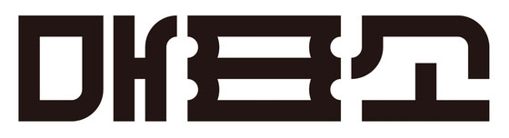

# PROJECT 2 | 매표소 (PWA App/Web Develop)
> 문화 공연 예매 플랫폼 웹/앱 사이트 개발 (PWA)
 

* 기여도 : 개인 100%   
* 기간 : 2022.11

## 매표소란?
  

문화 공연 예매 플랫폼의 하나로 연극, 뮤지컬, 콘서트, 전시회 등을 예매할 수 있는 애플리케이션입니다.

## 📍 Overview

사용자의 이목을 끄는 것과 동시에 더욱 편하게 서비스를 이용할 수 있도록 리디자인하여 개발하였습니다.

## 🙋‍♀️🙋‍♂️ Target 

* 연극, 뮤지컬, 전시회 등 문화 공연을 즐기고 공연 예매를 하고자  사람  
* 관련 배우, 작가를 좋아하는 팬  
* 관람한 공연에 대한 이야기를 나누고 싶은 관객  

## 💥 Problem

1. 기존의 문화 공연 플랫폼 <매표소> 의 경우 동일한 사이즈의 이미지 배열로 되어 있어 사용자의 흥미를 끌기 어려울 것이라고 판단하였습니다. 
2. 예매 외에는 사용자가 이용할만한 커뮤니티, 콘텐츠가 없어 애플리케이션에 머무는 시간이 짧습니다. 
3. 피드 페이지는 단순 뉴스 기사의 링크를 가져와 작성되어 있어 사용자의 이목을 끌기 어렵다고 생각하였습니다.

## ⭐ Solutions
1. 전체적으로 작고 동일한 사이즈의 이미지를 포스터 형식으로 사이즈를 키워 배치하였습니다. 
2. 이미지는 Swiper API, Isotope Plugin를 적용하여 보다 액티비티한 효과를 구현하였습니다. 
3. 피드 영역에는 하단에 관련 동영상을 배치하여 클릭시 팝업 형식으로 동영상을 볼 수 있도록 하였습니다. 
4. 애플리케이션을 설치하지 않더라도 사용자의 웹 사이트 방문이 용이하도록 PWA 웹 앱 사이트를 구축하였습니다.
 

***

## ⏰ Timeline 
| Week | coding | git | 작업 내용 |
| ------ | -- | -- |----------- |
| 1주차 |  |  | 디자인 콘셉트 잡기 / 와이어 프레임, 프로토타입 프레임 제작 (Figma) |
| 2주차 | ☑️ | ☑️ | Markup (홈, 예매, 피드, 메뉴) / Sass 홈페이지 스타일 구현 |
| 3주차 | ☑️ | ☑️ | Javascript 기능 구현 |
| 4주차 |  |  | 보고서 제작 / 발표 |

 

## 🚀 Skills 
      
